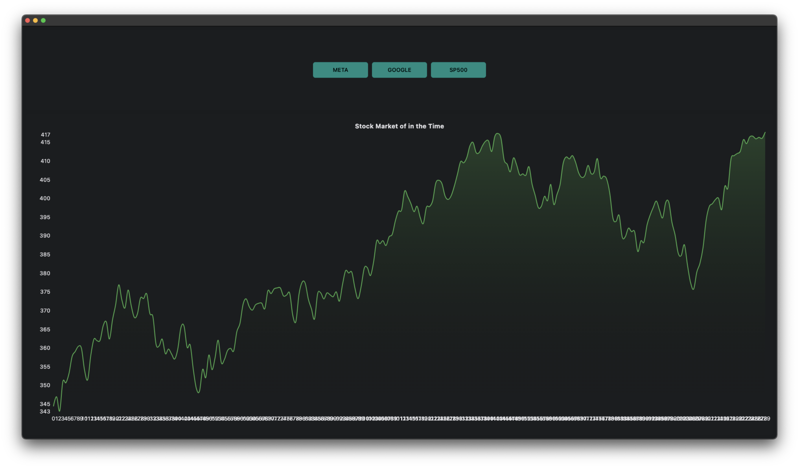

## Stock Market App

### Description

Application to graphically analyze some actions over time, using the python framework called #flet.

### Author

![denisberroeta@gmail.com]

### Todo

- Chart line with plotly
- Create limited symbol selector
- Add more than one symbol
- Add calendar selector date
- AI forcasting
